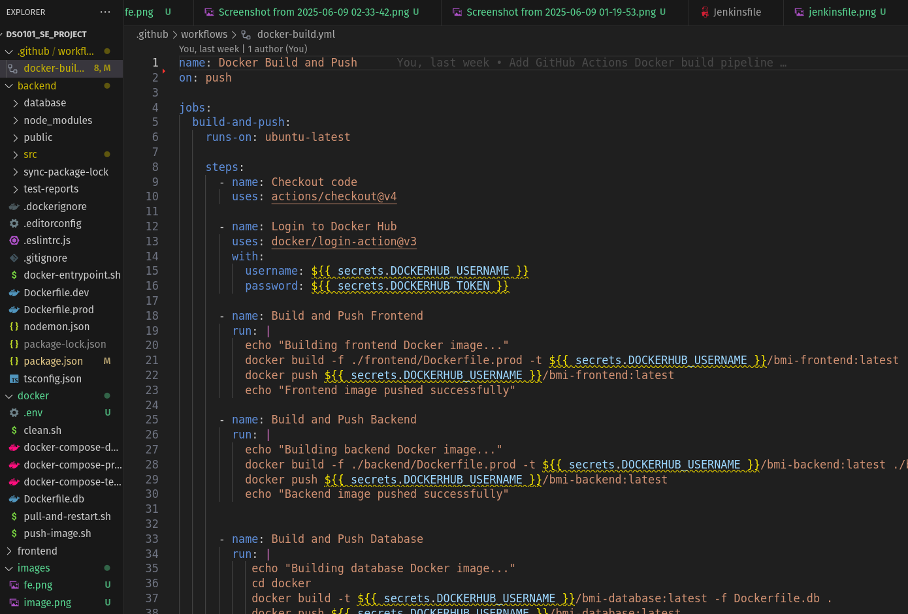

# BMI Calculator CI/CD Pipeline Project

## Project Overview

This project creates a BMI (Body Mass Index) Calculator using a complete web application with automatic deployment. Think of it like building a calculator that works on the internet and gets updated automatically whenever we make changes!

## Objectives

- Build a BMI Calculator: Create a web app where users can calculate their BMI

- Store Data: Save BMI calculations in a database so we can see history

- Use Docker: Package our app in containers (like shipping boxes for code)

- Automate Everything: Set up robots (Jenkins & GitHub Actions) to deploy our app automatically

- Deploy Online: Put our app on the internet so anyone can use it

## Implementation Steps

## Basic set up

### Step 1: Set Up Development Environment

- Fork and clone the repository

- Start the development environment:

### Step 2: Implement the Database Migration

### Step 3: Add Backend Code

BMI Controller: Handled the business logic for calculating BMI and managing database operations

BMI Routes: Defined the API endpoints for the BMI service

### Step 4: Create Frontend Components

Form inputs for height, weight, and age

BMI calculation and result display

History viewing to see past BMI calculations

Responsive styling that looks professional

create a knexfile.js in the backend directory to configure the database connection for migrations.

### step 5 : Test the BMI API

POST: Returns a JSON object with BMI ~22.86 and category "Normal weight"

GET: Returns an array with your BMI records

GET latest: Returns the most recent BMI record

### step 6 : Start frontend

#### accomplished till now

Complete PERN Stack Implementation

BMI Calculator Service - Fully functional with all requirements

Database Persistence - Storing and retrieving user BMI data

API Integration - Frontend successfully calling backend

## Stage 1: Docker Configuration

### step 1 : Configure Docker Volumes for BMI Data

update docker compose with bmi data volumes to ensure your PostgreSQL data (including BMI records) persists across container restarts.

### Step 2: Create Volume Directories

### Step 3: Test BMI data persistence

BMI API working - Creating records successfully

Data persistence - Records survive container restarts

### step 4: run BMI tests directly

#### accomplished till now

BMI data persisting across container restarts

All tests passing in the Docker environment

Proper volume configuration for data storage

## Stage 2: Jenkins Local Setup for GitHub Push Automation

Github credentials and personal access token are used from the previous assignments

### Step 1: Create Jenkins Pipeline Job

### Step 2: Create Jenkinsfile in Your Project Root

### Step 3: Pipeline Configuration 

Build Triggers:

### Step 4: Commit with "@push" in the commit message

Build gets triggered in jenkins and is successful

Successful execution of tests and the report file generated

## Stage 3: GitHub Actions Pipeline for Docker Builds

### Step 1: Set Up Docker Hub Credentials in GitHub Secrets

### Step 2: Create GitHub Actions Workflow

### Step 3: Verify the Pipeline

Actions tab

Check Docker Hub

## Stage 3: Deploy to Render

### Deploy PostgreSQL Database

Create Database Service

Select "PostgreSQL"

Configure the database:

Name: bmi-calculator-db

Database Name: bmi_calculator

User: admin

Save these credentials for later use in deploying the backend

### Deploy Backend API Service

Deploy from Docker Registry

In "Environment Variables" section, add: Database Internal URL

Deploy backend

### Deploy Frontend React App

Deploy from Docker Registry

In "Environment Variables" section, add: Backend URL

Deploy Frontend

connection with backend

BMI CALCULATED

## Challenges Faced & Solutions

### Challenge 1: Database Table Missing

Problem: BMI calculations failed because database table didn't exist

Solution: Created database setup endpoint to automatically create BMI table

### Challenge 2: Jenkins Authentication Issues

Problem: Jenkins couldn't connect to GitHub repository

Solution: Used Personal Access Tokens and proper credential configuration

### Challenge 3: Docker Build Failures

Problem: Database Dockerfile failed due to missing files

Solution: Simplified Dockerfile to use basic PostgreSQL image

### Challenge 4: Render Deployment Routing

Problem: Backend API endpoints returned "Endpoint not Found"

Solution: Fixed route registration in Express app.ts file

## Conclusion

This project successfully demonstrates a complete DevOps pipeline from development to production deployment

Successfully Completed:

Docker Configuration: All services containerized with persistent storage

CI/CD Pipeline: Automated testing and deployment working

Cloud Deployment: All services live on Render platform

Frontend: Beautiful, responsive BMI calculator interface

Backend: API endpoints responding and connected to database

Database: PostgreSQL database operational and connected

Minor Issues:

BMI calculation has internal server error (likely database schema mismatch)

This doesn't affect the overall architecture and CI/CD pipeline success

## Frontend: https://bmi-frontend-cihm.onrender.com/
## Backend API: https://bmi-backend-65dc.onrender.com/
## GitHub Repository: https://github.com/Kanishapradhan13/DSO101_SE_project

